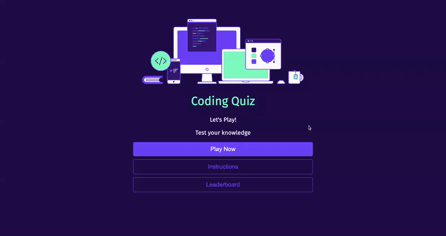

[![LinkedIn][linkedin-shield]][linkedin-url]

<!-- PROJECT LOGO -->
 

  

<h3 align="center">Coding Quiz</h3>

  

  In this coding quiz, you will learn about the fundamentals of JavaScript. There are 5 randomly selected multiple-choice questions and you will have a time limit of 50 seconds. The remaining time will determine your score at the end. Make sure you answer all the questions within the timeframe, but keep in mind that you will be penalised by 10 seconds for every incorrect answer!

 
<a href="https://github.com/XchHarutyunyan/coding-quiz"><strong>Explore the docs »</strong></a>
 
 
<a href="https://XchHarutyunyan.github.io/coding-quiz/">View Live Deployment</a>
·
<a href="https://github.com/XchHarutyunyan/coding-quiz/issues">Report Bug</a>
·
<a href="https://github.com/XchHarutyunyan/coding-quiz/issues">Request Feature</a>

  

<!-- TABLE OF CONTENTS -->

  
Table of Contents

  <ol>
    <li><a href="#usage">Usage</a></li>
    <li><a href="#contributing">Contributing</a></li>
    <li><a href="#acknowledgments">Acknowledgments</a></li>
  </ol>

## Usage

This application is useful for individuals studying JavaScript fundamentals. It would also be a handy way to prepare for the LinkedIn JavaScript Skills Assessment which features some of the questions.

You can view the functionality of this application below:

(<a href="#readme-top">back to top</a>)

<!-- CONTRIBUTING -->

## Contributing

Contributions are what make the open source community such an amazing place to learn, inspire, and create. Any contributions you make are **greatly appreciated**.

If you have a suggestion that would make this better, please fork the repo and create a pull request. You can also simply open an issue with the tag "enhancement".
Don't forget to give the project a star! Thanks again!

1. Fork the Project
2. Create your Feature Branch (`git checkout -b feature/AmazingFeature`)
3. Commit your Changes (`git commit -m 'Add some AmazingFeature'`)
4. Push to the Branch (`git push origin feature/AmazingFeature`)
5. Open a Pull Request

(<a href="#readme-top">back to top</a>)

## Acknowledgments

- [Flat Icon](https://www.flaticon.com/free-icon/podium_548481?related_id=548440&origin=search)
- [Vector Juice](https://www.freepik.com/author/vectorjuice)
- [FreePik](https://www.freepik.com/free-vector/question-mark-layered-3d-vector-font_18919699.htm#query=quiz&position=31&from_view=search&track=sph)
- [appendChild](https://developer.mozilla.org/en-US/docs/Web/API/Node/appendChild)
- [Arrow Functions](https://www.w3schools.com/js/js_arrow_function.asp)
- [Values](https://stackoverflow.com/questions/11563638/how-do-i-get-the-value-of-text-input-field-using-javascript)
- [Sorting an Array](https://stackoverflow.com/questions/5876424/sort-array-of-objects)
- [MDN on Web APIs](https://developer.mozilla.org/en-US/docs/Learn/JavaScript/Client-side_web_APIs/Introduction)
- [Introduction to DOM](https://www.youtube.com/watch?v=-0ZcldkGlt8)

- [What exactly is the DOM](https://bitsofco.de/what-exactly-is-the-dom/)
- [HTML DOM Navigation Extention](https://chrome.google.com/webstore/detail/html-dom-navigation/eimpgjcahblfpdgiknmbmglcafegimil/)
- [Introduction to Browser Events](https://javascript.info/introduction-browser-events)
- [Introduction to DOM events](https://www.smashingmagazine.com/2013/11/an-introduction-to-dom-events/)
- [What is an Event Loop](https://www.youtube.com/watch?v=8aGhZQkoFbQ)
- [7 Methods that aid DOM Manipulation](https://dev.to/desoga/7-javascript-methods-that-aids-dom-manipulation-kkj)
- [Introduction to local storage and session storage](https://alligator.io/js/introduction-localstorage-sessionstorage/)
- [localStorage vs sessionStorage](https://dev.to/caffiendkitten/localstorage-vs-sessionstorage-f9k)

(<a href="#readme-top">back to top</a>)

<!-- MARKDOWN LINKS & IMAGES -->

[linkedin-shield]: https://img.shields.io/badge/-LinkedIn-black.svg?style=for-the-badge&logo=linkedin&colorB=555
[linkedin-url]: https://www.linkedin.com/in/xch-harutyunyan
[product-screenshot]: assets/images/screenshot.png
